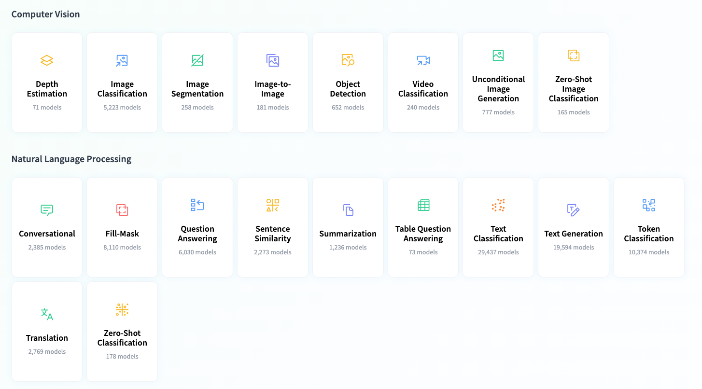
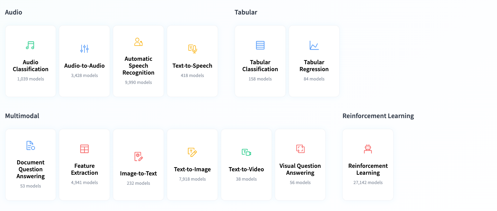

# Hugging Face Practise

Hugging Face is the home for all Machine Learning tasks. Here you can find what you need to get started with a task: demos, use cases, models, datasets, and more!

https://huggingface.co/tasks





Hugging Face是一個針對人工智慧的開源社群平台，使用者可以在上邊發表和共享預訓練模型、資料集和展示檔案等。目前Hugging Face上已經共享了超過10萬個預訓練模型，1萬多個資料集，包括微軟、Google、Bloomberg、英特爾等各個行業超過1萬家機構都在使用Hugging Face的產品。

相關影片內容, 根據排序觀看更佳
1. [李宏毅關於Elmo, Bert, GPT的講解](https://www.youtube.com/watch?v=UYPa347-DdE)
2. [Goebels關於transformerXL的講解](https://www.bilibili.com/video/BV1Tt411M7Wp/?from=search&seid=194654766718455422)
3. [Kilcher關於XLnet的講解](https://www.youtube.com/watch?v=H5vpBCLo74U)
4. [McCormick關於ALBERT的講解](https://www.youtube.com/watch?v=vsGN8WqwvKg&t=597s)

## Python env

* https://packaging.python.org/en/latest/guides/installing-using-pip-and-virtual-environments/

```sh
# Installing virtualenv
python3 -m pip install --user virtualenv

# Creating a virtual environment
python3 -m venv env

# Activating a virtual environment
source env/bin/activate
```

## PyTorch & Flax
* https://huggingface.co/docs/diffusers/v0.18.2/en/installation

PyTorch
* https://pytorch.org/get-started/locally/
* https://pytorch.org/get-started/previous-versions/

```sh
# install pytorch (Mac)
pip3 install torch torchvision torchaudio

# install pytorch (Windows 11 GPU)
pip3 install torch torchvision torchaudio --index-url https://download.pytorch.org/whl/cu117

# install pytorch (Windows 11 CPU)
pip3 install torch torchvision torchaudio

# 🤗 Diffusers also relies on the 🤗 Transformers library, and you can install both with the following command:
pip3 install 'diffusers[torch]' 'transformers'
```

Flax
```sh
pip3 install 'diffusers[flax]'
# 🤗 Diffusers also relies on the 🤗 Transformers library, and you can install both with the following command:
pip3 install 'diffusers[flax]' 'transformers'
```

## Transformers
* https://huggingface.co/docs/transformers/index
* models: https://huggingface.co/models
* install : https://huggingface.co/docs/transformers/installation#install-with-pip

一個完整的transformer模型主要包含三部分：

1. Config

控制模型的名稱、最終輸出的樣式、隱藏層寬度和深度、激活函數的類別等。將Config類導出時文件格式為 json格式，就像下面這樣：

```json
{
  "attention_probs_dropout_prob": 0.1,
  "hidden_act": "gelu",
  "hidden_dropout_prob": 0.1,
  "hidden_size": 768,
  "initializer_range": 0.02,
  "intermediate_size": 3072,
  "max_position_embeddings": 512,
  "num_attention_heads": 12,
  "num_hidden_layers": 12,
  "type_vocab_size": 2,
  "vocab_size": 30522
}
```
當然，也可以通過config.json來實例化Config類，這是一個互逆的過程。

2. Tokenizer

這是一個將純文本轉換為編碼的過程。
`注意，Tokenizer並不涉及將詞轉化為詞向量的過程，僅僅是將純文本分詞，添加[MASK]標記、[SEP]、[CLS]標記，並轉換為字典索引。` 
Tokenizer類導出時將分為三個文件，也就是：

* `vocab.txt`
詞典文件，每一行為一個詞或詞的一部分

* `special_tokens_map.json` 特殊標記的定義方式

```json
{
    "unk_token": "[UNK]", 
    "sep_token": "[SEP]", 
    "pad_token": "[PAD]", 
    "cls_token": "[CLS]", 
    "mask_token": "[MASK]"
}
```

* `tokenizer_config.jso`n` 配置文件，主要存儲特殊的配置。

3. Model

也就是各種各樣的模型。
除了初始的Bert、GPT等基本模型，針對下游任務，還定義了諸如`BertForQuestionAnswering`等下游任務模型。
模型導出時將生成`config.json`和`pytorch_model.bin`參數文件。
前者就是1中的配置文件，這和我們的直覺相同，即config和model應該是緊密聯繫在一起的兩個類。
後者其實和torch.save()存儲得到的文件是相同的，這是因為Model都直接或者間接繼承了Pytorch的Module類。
從這裡可以看出，HuggingFace在實現時很好地尊重了Pytorch的原生API。


## Diffusers
Installation : https://huggingface.co/docs/diffusers/installation

### Pipeline
* https://huggingface.co/docs/diffusers/main/en/api/pipelines/overview


## Hub

* https://huggingface.co/docs/hub/repositories-getting-started

To be able to push your code to the Hub, you’ll need to authenticate somehow. The easiest way to do this is by installing the huggingface_hub CLI and running the login command:

```sh
python3 -m pip install huggingface_hub
huggingface-cli login
```

### Hugging Face Space
Spaces are one of the most popular ways to share ML applications and demos with the world.

https://huggingface.co/spaces/launch

<iframe width="1280" height="720" src="https://www.youtube.com/embed/3bSVKNKb_PY" title="Build and Deploy a Machine Learning App in 2 Minutes" frameborder="0" allow="accelerometer; autoplay; clipboard-write; encrypted-media; gyroscope; picture-in-picture; web-share" allowfullscreen></iframe>

#### demo
1. Create a Space -> `Streamlit`
2. `git clone git@hf.co:spaces/kimi0230/demo`
```sh
git submodule add git@hf.co:spaces/kimi0230/DemoStreamlit Space/Demo-Streamlit
```

Other Sample
Image to Story : Upload an image, get a story made by Llama2 !
https://huggingface.co/spaces/fffiloni/Image-to-Story


## Miscellaneous


### 'LayerNorm' is one of the layers in the Model.
```
'LayerNorm' is one of the layers in the Model. Looks like you're trying to load the diffusion model in float16(Half) format on CPU which is not supported. For float16 format, GPU needs to be used. For CPU run the model in float32 format.
Reference: https://github.com/pytorch/pytorch/issues/52291
```

#### RuntimeError: "LayerNormKernelImpl" not implemented for 'Half'
* https://huggingface.co/CompVis/stable-diffusion-v1-4/discussions/64

##### Method 1

change
```python
pipe = StableDiffusionPipeline.from_pretrained(
    model_id, scheduler=scheduler, torch_dtype=torch.float16)
```

to 
```python
pipe = StableDiffusionPipeline.from_pretrained(
    model_id, scheduler=scheduler, torch_dtype=torch.float32)
```

##### Method 2

* https://stackoverflow.com/questions/75641074/i-run-stable-diffusion-its-wrong-runtimeerror-layernormkernelimpl-not-implem

```python
commandline_args = os.environ.get('COMMANDLINE_ARGS', "--precision full --no-half")
sys.argv+=shlex.split(commandline_args)
```

### Potential NSFW content was detected in one or more images. A black image will be returned instead. Try again with a different prompt and/or seed.

* https://github.com/CompVis/stable-diffusion/issues/239
```py
pipe.safety_checker = lambda images, clip_input: (images, False)
```

### zsh: no matches found: diffusers[torch]

* [zsh: no matches found: ray[tune] #6696](https://github.com/ray-project/ray/issues/6696)

## Reference
* [huggingface/diffusers](https://github.com/huggingface/diffusers)
* https://huggingface.co/docs/diffusers/
* [huggingface/transformers](https://github.com/huggingface/transformers)
* https://huggingface.co/docs/transformers/index
* [AUTOMATIC1111 / stable-diffusion-webui](https://github.com/AUTOMATIC1111/stable-diffusion-webui)
* [Youtube: Getting Started With Hugging Face in 15 Minutes | Transformers, Pipeline, Tokenizer, Models ](https://www.youtube.com/watch?v=QEaBAZQCtwE)
* [HuggingGPT爆紅，Hugging Face又是什麼？它正在拆掉OpenAI的圍牆，要當AI界的Github](https://www.techbang.com/posts/105484-hugginggpt-is-on-fire-what-is-hugging-face-hugging-face-a-2)
* [HuggingFace-transformers系列的介绍以及在下游任务中的使用](https://www.cnblogs.com/dongxiong/p/12763923.html)